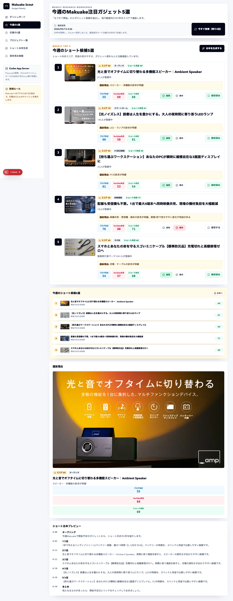
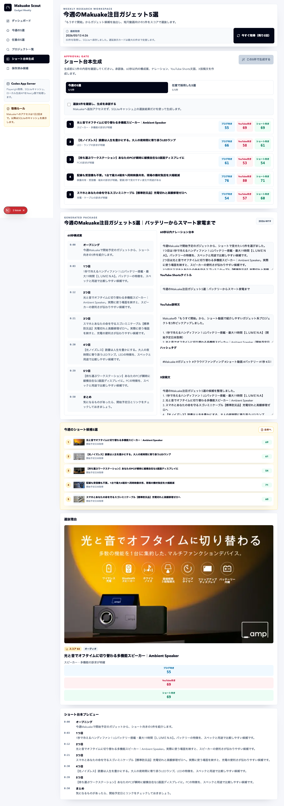

# Makuake Gadget Weekly Scout

Makuake Gadget Weekly Scout is a local-first Next.js application for researching
Makuake coming-soon projects and preparing a weekly short-video lineup.

It is designed for creators who make recurring videos such as
「今週のMakuake注目ガジェット5選」 and want a repeatable workflow for discovery,
scoring, human approval, script generation, and saved research notes.

## Features

- Fetches Makuake coming-soon project cards with Playwright.
- Stores results in SQLite under `.codex-app-server/` for cache-first reuse.
- Limits Makuake access to 2 user-approved fetches per day.
- Scores gadget-like projects using category, keyword, freshness, and video-hook signals.
- Downranks or excludes food, fashion, and experience-led projects.
- Selects an automatic weekly top 5 for Shorts.
- Supports a manual top 5 based on the user's selected URLs and feedback.
- Learns from `selected` and `rejected` project feedback to adjust future ranking.
- Generates a short-video structure, narration draft, YouTube Shorts metadata, and X post text.
- Lets users save candidate projects and add notes.

## Screenshots

Dashboard:


Weekly top 5:



Script generation:



## Tech Stack

- Next.js
- TypeScript
- Tailwind CSS
- Playwright
- SQLite
- Codex App Server style local workflow

## Local Setup

```bash
npm install
npm run dev:3001
```

Open:

```text
http://127.0.0.1:3001/
```

Use `npm run dev` if port `3000` is available.

## Verification

```bash
npm run typecheck
npm run build
```

## Access Policy

This project intentionally avoids aggressive scraping.

- Makuake access is triggered only after a user confirmation dialog.
- The app enforces a daily fetch limit of 2.
- Cached SQLite data is shown when the daily limit has been reached.
- Generated scripts are produced only after the user confirms the selected projects.

This project is not affiliated with Makuake. Users should follow Makuake's
terms and robots/access policies when using or modifying the scraper.

## Data Storage

Runtime cache and user notes are stored locally in:

```text
.codex-app-server/makuake-scout.sqlite
```

This file is ignored by Git and should not be committed.

## OSS Status

This repository is prepared for open-source publication under the MIT License.

Before submitting the Codex for Open Source form, publish the GitHub repository
with public visibility and add real usage signals such as stars, issues, pull
requests, creator feedback, or demo links when available.

## Contributing

See [CONTRIBUTING.md](./CONTRIBUTING.md).

## Security

See [SECURITY.md](./SECURITY.md).
